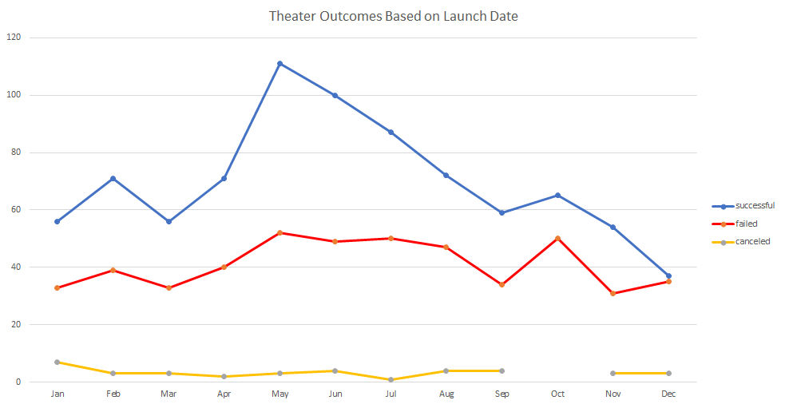
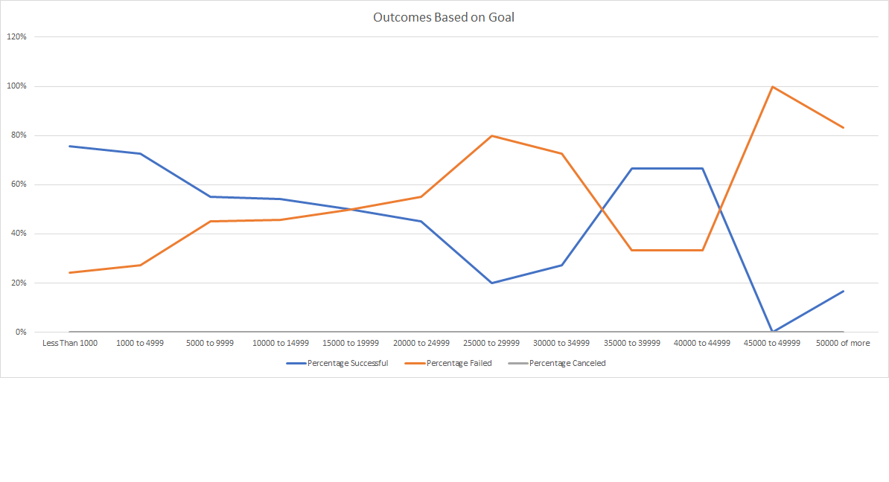
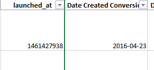
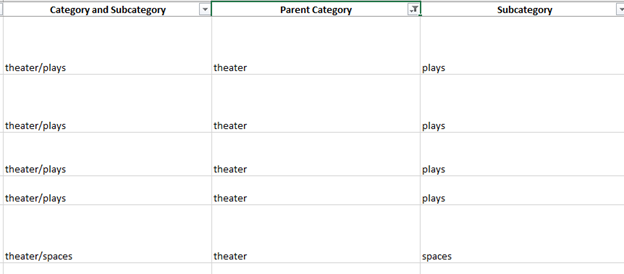

# Kickstarting with Excel UofT Data Bootcamp Module 1 Challenge

## Overview of Project
### Purpose

The client, Louise, recently completed a Kickstarter campaign for her play "Fever" and achieved close to her goal in a short amount of time. She is interested in knowing how different campaigns fared in relation to their launch dates and funding goals. Using Excel an analysis of the given Kickstarter data was performed and 2 graphs generated.

## Analysis and Challenges
### Analysis of Outcomes Based on Launch Date
The data was summarized in a pivot table. The count of successful, failed and cancelled outcomes was tallied per launch month. A graph was prepared from the pivot table as below.

### Analysis of Outcomes Based on Goals 
The data for plays was isolated and was further sorted by the goal amount for each campaign. A count of successful, failed and canceled was determined and summed. The percentages were then calculated and pictured below

### Challenges and Difficulties Encountered
The data set given contained information for all types of Kickstarter campaigns and the client is interested in campaigns like hers. As pictured below, one of the challenges was to convert the dates from Unix code timestamp to a format readable by Excel, as pictured below.

Another challenge was to isolate the parent category of theater and the subcategory of plays from a combined column in the raw data.

## Results
Two graphs were generated for this analysis and it is possible to perform further analysis. The first graph is Theater Outcomes by launch date. Firstly, the graph suggests that campaign launches in May are more likely to succeed. Secondly, the graph also suggests that campaign launches in October are more likely to fail than succeed. The second graph, Outcomes based on Goals, shows that, in general, the higher the goal amount the more likely the campaign would be considered to fail. There is an inversion of this result at $35000 to 45000 but there are few data points in this range to be conclusive. 
The dataset does not include information on the motivation of donors which limits its ability to come up with conclusions. In general, the analysis is that there are good months to start a campaign and the higher the goal the less likely to succeed. Further analysis could be additional graphs such as comparing goal versus pledged for plays or outcomes versus end date.

